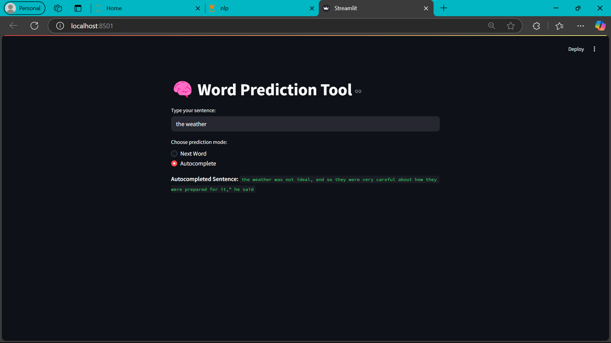

# GPT-2 Word Prediction Web App

This is a simple NLP web app using OpenAI's GPT-2 model for:
- 🔮 Next-word prediction
- ✍️ Sentence autocomplete

Built with [Streamlit](https://streamlit.io) and Hugging Face Transformers.

## 🚀 Features

- Real-time word prediction
- Autocomplete with configurable text length
- Clean web interface

## 🛠️ How to Run

1. Clone this repo:
   ```bash
   git clone https://github.com/yourusername/nlpproject.git
   cd nlpproject

2. (Optional) Set up a virtual environment
   ```bash
   python -m venv venv
   venv\Script\activate

3. Install dependencies
   ```bash
   pip install -r requirements.txt

4. Run the Streamlit app
   ```bash
   streamlit run app.py

## 📸 Screenshot


